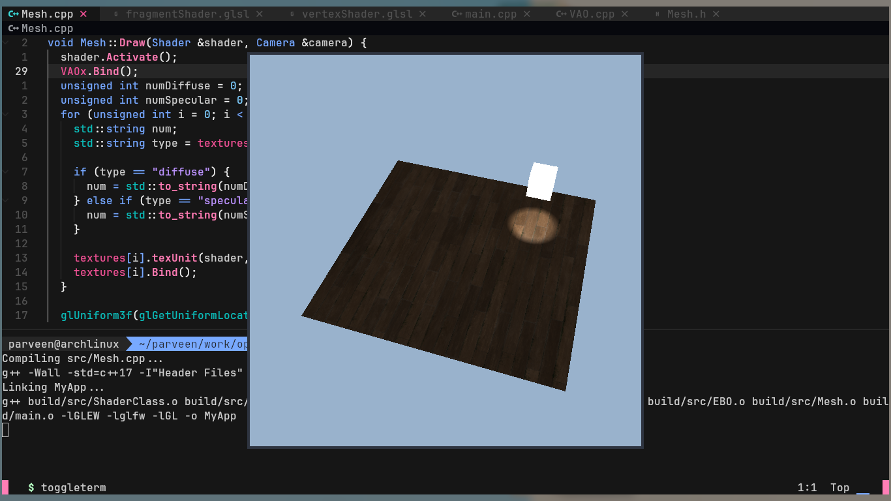
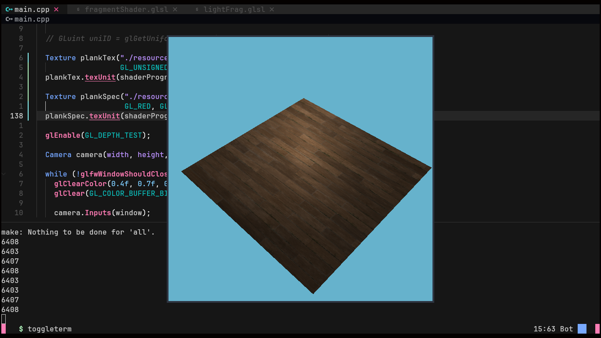

# OpenGL Lighting Engine

A modern OpenGL rendering project written in C++ using GLFW, GLEW, and GLM.
Implements textured meshes, lighting, camera movement, and shader-based rendering.


## Features

- OpenGL 3.3 Core Profile
- Phong lighting
- Diffuse + specular textures
- Camera movement
- Shader abstraction
- Mesh abstraction
- Depth testing
- Texture loading


## Dependencies

- OpenGL
- GLFW
- GLEW
- GLM

## Screenshots







```bash
sudo pacman -S glfw-x11 glew glm mesa
```

## 6. Build Instructions

```bash
g++ -std=c++17 \
    main.cpp src/*.cpp \
    -Iinclude \
    -lglfw -lGLEW -lGL \
    -o app
```


## Controls

| Key | Action |
|-----|--------|
| W A S D | Move camera |
| Mouse | Look around |
| Scroll | Zoom |
| ESC | Exit |
